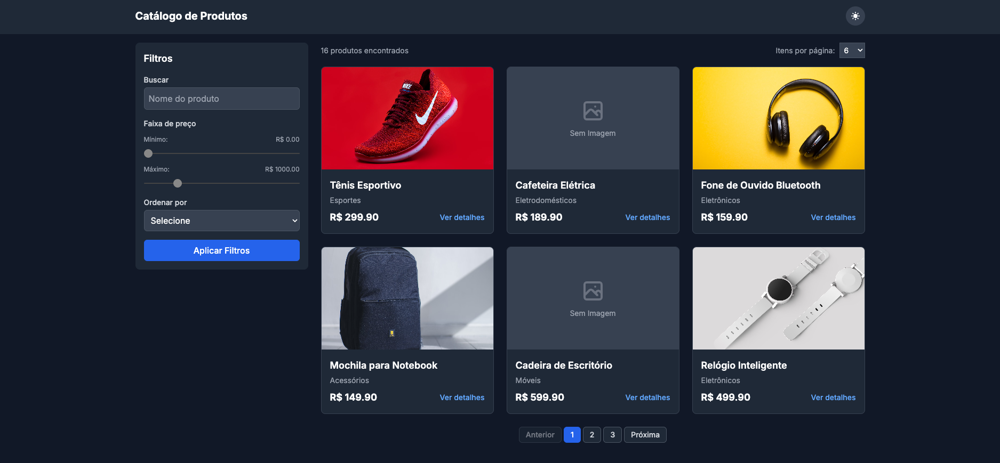

# Catálogo de Produtos

## 📋 Sobre o Projeto

O Catálogo de Produtos é uma aplicação web desenvolvida com Next.js e React que permite visualizar, filtrar, ordenar e gerenciar produtos. O sistema foi projetado para oferecer uma experiência de usuário fluida e responsiva, com recursos como paginação, tema escuro/claro, visualização detalhada de produtos e gerenciamento de estado global.

## 🎯 Objetivo

O objetivo principal deste projeto é demonstrar a implementação de um catálogo de produtos moderno e responsivo, utilizando as melhores práticas de desenvolvimento web. A aplicação serve como exemplo de como construir interfaces interativas com React e Next.js, implementando funcionalidades comuns em e-commerces e catálogos online.

## 🚀 Tecnologias Utilizadas

- **Next.js 14**: Framework React com renderização do lado do servidor
- **React 18**: Biblioteca para construção de interfaces
- **TypeScript**: Linguagem tipada baseada em JavaScript
- **Tailwind CSS**: Framework CSS utilitário
- **Jest**: Framework de testes
- **React Testing Library**: Biblioteca para testes de componentes React

## 📋 Pré-requisitos

Antes de começar, você precisará ter instalado em sua máquina:

- [Node.js](https://nodejs.org/) (v18 ou superior)
- [npm](https://www.npmjs.com/) (v8 ou superior) ou [Yarn](https://yarnpkg.com/) (v1.22 ou superior)
- [Git](https://git-scm.com/)

## 🔧 Instalação

Siga estes passos para instalar e configurar o projeto em sua máquina local:

1. Clone o repositório:
   \`\`\`bash
   git clone https://github.com/seu-usuario/catalogo-produtos.git
   cd catalogo-produtos
   \`\`\`

2. Instale as dependências:
   \`\`\`bash
   npm install
   # ou
   yarn install
   \`\`\`

## ⚡ Como Executar o Projeto

Para executar o projeto em ambiente de desenvolvimento:

\`\`\`bash
npm run dev
# ou
yarn dev
\`\`\`

Acesse [http://localhost:3000](http://localhost:3000) no seu navegador para ver a aplicação.

Para construir e executar a versão de produção:

\`\`\`bash
npm run build
npm start
# ou
yarn build
yarn start
\`\`\`

## 🧪 Executando os Testes

O projeto utiliza Jest e React Testing Library para testes. Para executar os testes:

\`\`\`bash
# Executar todos os testes
npm test
# ou
yarn test

# Executar testes em modo de observação
npm run test:watch
# ou
yarn test:watch

# Verificar cobertura de testes
npm run test:coverage
# ou
yarn test:coverage
\`\`\`

## 📁 Estrutura do Projeto

\`\`\`
├── app/                  # Diretório principal do Next.js App Router
│   ├── api/              # Rotas de API
│   ├── layout.tsx        # Layout principal da aplicação
│   ├── page.tsx          # Página inicial (catálogo)
│   └── globals.css       # Estilos globais
├── components/           # Componentes React reutilizáveis
├── contexts/             # Contextos React para gerenciamento de estado
├── public/               # Arquivos estáticos
│   └── images/           # Imagens dos produtos
├── __tests__/            # Testes automatizados
└── types/                # Definições de tipos TypeScript
\`\`\`

## ✨ Funcionalidades

- **Listagem de Produtos**: Visualização em grid responsivo
- **Filtragem**: Por nome, preço e categoria
- **Ordenação**: Por nome e preço (crescente/decrescente)
- **Paginação**: Navegação entre páginas de produtos
- **Tema Escuro/Claro**: Alternância entre temas
- **Modal de Detalhes**: Visualização detalhada de produtos
- **Responsividade**: Adaptação para diferentes tamanhos de tela
- **Persistência**: Dados salvos no localStorage

## 🤝 Contribuição

Contribuições são bem-vindas! Para contribuir:

1. Faça um fork do projeto
2. Crie uma branch para sua feature (`git checkout -b feature/nova-feature`)
3. Faça commit das suas alterações (`git commit -m 'Adiciona nova feature'`)
4. Faça push para a branch (`git push origin feature/nova-feature`)
5. Abra um Pull Request

## 📄 Licença

Este projeto está licenciado sob a licença MIT - veja o arquivo [LICENSE.md](LICENSE.md) para mais detalhes.

---

Desenvolvido com ❤️ por [Seu Nome](https://github.com/seu-usuario)
